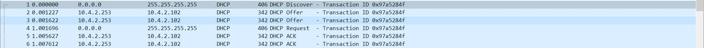

I. Topologie 1 : simple

1. Présentation de la topo
2. Mise en place
   B. Définition d'IPs statiques

> admin1

C'est une CentOS7. Vous commencez à avoir l'habitude.

🌞 Configurer la machine CentOS7 :

désactivation de SELinux : sudo setenforce 0, Changer la valeur de SELINUX à permissive dans /etc/selinux/config.

installation de paquets liés au réseau, en particulier traceroute pour ce TP : déjà fait sur le patron.

définition d'une IP statique (se référer au tableau d'adressage) : nano /etc/sysconfig/network-scripts/ifcfg-enp0s8 et mettre l'ip qu'on veut.

définition d'un nom d'hôte : nano /etc/hostname et mettre ce qu'on veut.

> router1

🌞 Configurer le routeur :

définition d'une IP statique (se référer au tableau d'adressage) :
"conf t" puis "interface fastethernet 0/0" "ip address 10.4.1.254 255.255.255.0" "ip
puis "no shut" puis "interface fastethernet 0/1" "ip address 10.4.2.254 255.255.255.0" puis "no shut"
puis copy running-config startup-config.

définition d'un nom (depuis l'interface de GNS3) : doucle click sur le nom et le changer.

"copy running-config startup-config" pour enregistrer.

🌞 Configurer le VPCS :

définition d'une IP statique : "ip address 10.4.2.11 255.255.255.0" puis save.

définition d'un nom (depuis l'interface de GNS3) doucle click sur le nom et le changer.

🌞 Vérifier et PROUVER que :

guest1 peut joindre le routeur : "ping 10.4.2.254" à partir de guest1 :

guest1> ping 10.4.2.254
84 bytes from 10.4.2.254 icmp_seq=1 ttl=255 time=42.807 ms
84 bytes from 10.4.2.254 icmp_seq=2 ttl=255 time=3.514 ms
84 bytes from 10.4.2.254 icmp_seq=3 ttl=255 time=5.139 ms
84 bytes from 10.4.2.254 icmp_seq=4 ttl=255 time=2.162 ms
84 bytes from 10.4.2.254 icmp_seq=5 ttl=255 time=6.788 ms

admin1 peut joindre le routeur : "ping 10.4.1.254" à partir de admin1 :

[root@admin1 ~]# ping 10.4.1.254
PING 10.4.1.254 (10.4.1.254) 56(84) bytes of data.
64 bytes from 10.4.1.254: icmp_seq=1 ttl=255 time=19.5 ms
64 bytes from 10.4.1.254: icmp_seq=2 ttl=255 time=5.22 ms
64 bytes from 10.4.1.254: icmp_seq=3 ttl=255 time=3.95 ms
64 bytes from 10.4.1.254: icmp_seq=4 ttl=255 time=13.0 ms
64 bytes from 10.4.1.254: icmp_seq=5 ttl=255 time=4.88 ms
^C
--- 10.4.1.254 ping statistics ---
5 packets transmitted, 5 received, 0% packet loss, time 4010ms
rtt min/avg/max/mdev = 3.951/9.344/19.570/6.076 ms

router1 peut joindre les deux autres machines : "ping 10.4.1.11" et "ping 10.4.2.11" à partir du routeur :

R1#ping 10.4.1.11

Type escape sequence to abort.
Sending 5, 100-byte ICMP Echos to 10.4.1.11, timeout is 2 seconds:
!!!!!
Success rate is 100 percent (5/5), round-trip min/avg/max = 32/37/48 ms

R1#ping 10.4.2.11

Type escape sequence to abort.
Sending 5, 100-byte ICMP Echos to 10.4.2.11, timeout is 2 seconds:
!!!!!
Success rate is 100 percent (5/5), round-trip min/avg/max = 32/35/40 ms

vérifier la table ARP de router1. Par vérifier, j'entends :

s'assurer qu'il a bien guest1 et admin1 dans sa table ARP : (je fais le rendu à la fin donc j'ai la plupart des arps).

R1#show arp
Protocol Address Age (min) Hardware Addr Type Interface
Internet 10.4.1.11 22 0800.279d.1907 ARPA FastEthernet0/0
Internet 10.4.2.11 32 0050.7966.6800 ARPA FastEthernet1/0
Internet 192.168.122.1 2 5254.0098.65cc ARPA FastEthernet2/0
Internet 192.168.122.169 - cc03.04f3.0020 ARPA FastEthernet2/0
Internet 10.4.1.254 - cc03.04f3.0000 ARPA FastEthernet0/0
Internet 10.4.2.254 - cc03.04f3.0010 ARPA FastEthernet1/0

s'assurer que les adresses MAC sont les bonnes (en les affichant directement depuis guest1 et admin1) :

3: enp0s8: <BROADCAST,MULTICAST,UP,LOWER_UP> mtu 1500 qdisc pfifo_fast state UP group default qlen 1000
link/ether 08:00:27:9d:19:07 brd ff:ff:ff:ff:ff:ff
inet 10.4.1.11/24 brd 10.4.1.255 scope global noprefixroute enp0s8
valid_lft forever preferred_lft forever
inet6 fe80::a00:27ff:fe9d:1907/64 scope link
valid_lft forever preferred_lft forever

guest1> sh

NAME IP/MASK GATEWAY MAC LPORT RHOST:PO RT
guest1 10.4.2.11/24 10.4.2.254 00:50:79:66:68:00 20020 127.0.0. 1:20021
fe80::250:79ff:fe66:6800/64

🌞 Ajouter une route sur admin1 pour qu'il puisse joindre le réseau guests :

nano /etc/sysconfig/network-scripts/route-enp0s8 -> 10.4.2.0 via 10.4.1.254 dev enp0s8

🌞 Ajouter une route sur guest1 pour qu'il puisse joindre le réseau guests :

ip 10.4.2.11/24 10.4.2.254

🌞 Vérifier et PROUVER que :

guest1 peut joindre le admin1 et réciproquement :

[root@admin1 ~]# ping 10.4.2.11
PING 10.4.2.11 (10.4.2.11) 56(84) bytes of data.
64 bytes from 10.4.2.11: icmp_seq=1 ttl=63 time=3023 ms
64 bytes from 10.4.2.11: icmp_seq=2 ttl=63 time=2021 ms
64 bytes from 10.4.2.11: icmp_seq=3 ttl=63 time=1020 ms
64 bytes from 10.4.2.11: icmp_seq=4 ttl=63 time=20.3 ms
64 bytes from 10.4.2.11: icmp_seq=5 ttl=63 time=12.6 ms
^C
--- 10.4.2.11 ping statistics ---
5 packets transmitted, 5 received, 0% packet loss, time 4005ms
rtt min/avg/max/mdev = 12.617/1219.705/3023.086/1168.796 ms, pipe 4

guest1> ping 10.4.1.11
84 bytes from 10.4.1.11 icmp_seq=1 ttl=63 time=13.735 ms
84 bytes from 10.4.1.11 icmp_seq=2 ttl=63 time=21.426 ms
84 bytes from 10.4.1.11 icmp_seq=3 ttl=63 time=13.914 ms
84 bytes from 10.4.1.11 icmp_seq=4 ttl=63 time=14.436 ms
84 bytes from 10.4.1.11 icmp_seq=5 ttl=63 time=11.912 ms

les paquets transitent par router :

[root@admin1 ~]# traceroute 10.4.2.11
traceroute to 10.4.2.11 (10.4.2.11), 30 hops max, 60 byte packets
1 10.4.1.254 (10.4.1.254) 3.305 ms 3.018 ms 2.938 ms
2 10.4.2.11 (10.4.2.11) 3014.341 ms 6008.520 ms 9019.433 ms

guest1> trace 10.4.1.11
trace to 10.4.1.11, 8 hops max, press Ctrl+C to stop
1 10.4.2.254 14.023 ms 9.986 ms 8.931 ms
2 \*10.4.1.11 18.268 ms (ICMP type:3, code:10, Host administratively prohibited)

II. Topologie 2 : dumb switches

2. Mise en place

C. Vérification

🌞 Vérifier et PROUVER que :

guest1 peut toujours joindre le admin1 et réciproquement

[root@admin1 ~]# ping 10.4.2.11
PING 10.4.2.11 (10.4.2.11) 56(84) bytes of data.
64 bytes from 10.4.2.11: icmp_seq=1 ttl=63 time=6784 ms
64 bytes from 10.4.2.11: icmp_seq=2 ttl=63 time=5781 ms
64 bytes from 10.4.2.11: icmp_seq=3 ttl=63 time=4779 ms
64 bytes from 10.4.2.11: icmp_seq=4 ttl=63 time=3778 ms
64 bytes from 10.4.2.11: icmp_seq=5 ttl=63 time=2775 ms
64 bytes from 10.4.2.11: icmp_seq=6 ttl=63 time=1776 ms
64 bytes from 10.4.2.11: icmp_seq=7 ttl=63 time=773 ms
64 bytes from 10.4.2.11: icmp_seq=8 ttl=63 time=21.3 ms

guest1> ping 10.4.1.11
84 bytes from 10.4.1.11 icmp_seq=1 ttl=63 time=20.722 ms
84 bytes from 10.4.1.11 icmp_seq=2 ttl=63 time=16.304 ms
84 bytes from 10.4.1.11 icmp_seq=3 ttl=63 time=19.218 ms
84 bytes from 10.4.1.11 icmp_seq=4 ttl=63 time=14.395 ms
84 bytes from 10.4.1.11 icmp_seq=5 ttl=63 time=11.801 ms

les paquets transitent toujours par router

[root@admin1 ~]# traceroute 10.4.2.11
traceroute to 10.4.2.11 (10.4.2.11), 30 hops max, 60 byte packets
1 10.4.1.254 (10.4.1.254) 18.778 ms 18.473 ms 19.160 ms
2 10.4.2.11 (10.4.2.11) 3025.382 ms 6031.526 ms 9035.709 ms

guest1> trace 10.4.1.11
trace to 10.4.1.11, 8 hops max, press Ctrl+C to stop
1 10.4.2.254 5.188 ms 8.476 ms 9.688 ms
2 \*10.4.1.11 18.296 ms (ICMP type:3, code:10, Host administratively prohibited)

III. Topologie 3 : adding nodes and NAT

2. Mise en place

B. VPCS

🌞 Configurer les VPCS

: définition d'une IP statique : "ip address <ip voulu> 255.255.255.0" puis save.

: ajouter une route sur pour qu'ils puissent joindre le réseau admins : ip <ip du guest> 10.4.2.254

🌞 Vérifier et PROUVER que les VPCS joignent le réseau admins :

guest2> ping 10.4.1.11
84 bytes from 10.4.1.11 icmp_seq=1 ttl=63 time=18.994 ms
84 bytes from 10.4.1.11 icmp_seq=2 ttl=63 time=21.172 ms
84 bytes from 10.4.1.11 icmp_seq=3 ttl=63 time=13.354 ms
84 bytes from 10.4.1.11 icmp_seq=4 ttl=63 time=18.573 ms
84 bytes from 10.4.1.11 icmp_seq=5 ttl=63 time=12.479 ms

guest3> ping 10.4.1.11
84 bytes from 10.4.1.11 icmp_seq=1 ttl=63 time=29.853 ms
84 bytes from 10.4.1.11 icmp_seq=2 ttl=63 time=16.062 ms
84 bytes from 10.4.1.11 icmp_seq=3 ttl=63 time=17.876 ms
84 bytes from 10.4.1.11 icmp_seq=4 ttl=63 time=14.083 ms
84 bytes from 10.4.1.11 icmp_seq=5 ttl=63 time=19.755 ms

🌞 Configurer le routeur :

récupérer une IP en DHCP sur l'interface branchée au nuage NAT

conf t

interface fastethernet 0/0 (et ensuite 1/0)

ip address dhcp

no shut

copy running-config startup-config (sauvegarde les changements après avoir été arrêté).

configurer un NAT simple sur le routeur :

conf t

Interfaces "internes" :
(config)# interface fastEthernet 0/0 (ou 1/0)
(config-if)# ip nat inside

Interfaces "externe" :
(config)# interface fastEthernet 2/0
(config-if)# ip nat outside

(config)# access-list 1 permit any

ip nat inside source list 1 interface fastEthernet 2/0 overload

copy running-config startup-config

Configurer les clients :

🌞 Configurer tous les clients du réseau (client du réseau admins et clients du réseau guests) :

Si ce n'est pas déjà fait, ajouter une route par défaut sur tous les clients du réseau admins (y'en a qu'un) et du réseau guests.

Configurer l'utilisation d'un serveur DNS (mettez 1.1.1.1)

pour admin1, il y a toujours une section dans le mémo CentOS :

nano /etc/resolv.conf -> nameserver 1.1.1.1

pour les VPCS dans le réseau guests... mmmh... démerdez-vous :)

ip dns 1.1.1.1

Vérification
🌞 Vérifier et PROUVER que :

le routeur a un accès WAN (internet) :

R1#ping 8.8.8.8

Type escape sequence to abort.
Sending 5, 100-byte ICMP Echos to 8.8.8.8, timeout is 2 seconds :
!!!!!
Success rate is 100 percent (5/5), round-trip min/avg/max = 40/66/100 ms

tous les clients du réseau admins (y'en a toujours qu'un) et ceux du réseau guests ont un accès WAN (internet) :

[root@admin1 ~]# ping 8.8.8.8
PING 8.8.8.8 (8.8.8.8) 56(84) bytes of data.
64 bytes from 8.8.8.8: icmp_seq=1 ttl=51 time=30.8 ms
64 bytes from 8.8.8.8: icmp_seq=2 ttl=51 time=29.2 ms
64 bytes from 8.8.8.8: icmp_seq=3 ttl=51 time=26.3 ms
64 bytes from 8.8.8.8: icmp_seq=4 ttl=51 time=37.2 ms
64 bytes from 8.8.8.8: icmp_seq=5 ttl=51 time=33.2 ms
^C
--- 8.8.8.8 ping statistics ---
5 packets transmitted, 5 received, 0% packet loss, time 4010ms
rtt min/avg/max/mdev = 26.390/31.383/37.257/3.689 ms

guest1> ping 8.8.8.8
84 bytes from 8.8.8.8 icmp_seq=1 ttl=51 time=41.097 ms
84 bytes from 8.8.8.8 icmp_seq=2 ttl=51 time=22.017 ms
84 bytes from 8.8.8.8 icmp_seq=3 ttl=51 time=26.164 ms
84 bytes from 8.8.8.8 icmp_seq=4 ttl=51 time=28.847 ms
84 bytes from 8.8.8.8 icmp_seq=5 ttl=51 time=28.253 ms

guest2> ping 8.8.8.8
84 bytes from 8.8.8.8 icmp_seq=1 ttl=51 time=30.886 ms
84 bytes from 8.8.8.8 icmp_seq=2 ttl=51 time=27.562 ms
84 bytes from 8.8.8.8 icmp_seq=3 ttl=51 time=27.187 ms
84 bytes from 8.8.8.8 icmp_seq=4 ttl=51 time=28.751 ms
84 bytes from 8.8.8.8 icmp_seq=5 ttl=51 time=34.647 ms

guest3> ping 8.8.8.8
84 bytes from 8.8.8.8 icmp_seq=1 ttl=51 time=29.725 ms
84 bytes from 8.8.8.8 icmp_seq=2 ttl=51 time=40.753 ms
84 bytes from 8.8.8.8 icmp_seq=3 ttl=51 time=32.731 ms
84 bytes from 8.8.8.8 icmp_seq=4 ttl=51 time=24.906 ms
84 bytes from 8.8.8.8 icmp_seq=5 ttl=51 time=28.233 ms

tous les clients du réseau ont de la résolution de noms grâce au serveur DNS configuré :

[root@admin1 ~]# ping google.com
PING google.com (216.58.215.46) 56(84) bytes of data.
64 bytes from par21s17-in-f14.1e100.net (216.58.215.46): icmp_seq=1 ttl=50 time=30.2 ms
64 bytes from par21s17-in-f14.1e100.net (216.58.215.46): icmp_seq=2 ttl=50 time=39.4 ms
64 bytes from par21s17-in-f14.1e100.net (216.58.215.46): icmp_seq=3 ttl=50 time=28.9 ms
64 bytes from par21s17-in-f14.1e100.net (216.58.215.46): icmp_seq=4 ttl=50 time=38.1 ms
64 bytes from par21s17-in-f14.1e100.net (216.58.215.46): icmp_seq=5 ttl=50 time=35.0 ms
^C
--- google.com ping statistics ---
5 packets transmitted, 5 received, 0% packet loss, time 4009ms
rtt min/avg/max/mdev = 28.919/34.360/39.488/4.197 ms

guest1> ping google.com
google.com resolved to 216.58.215.46
84 bytes from 216.58.215.46 icmp_seq=1 ttl=50 time=30.815 ms
84 bytes from 216.58.215.46 icmp_seq=2 ttl=50 time=28.439 ms
84 bytes from 216.58.215.46 icmp_seq=3 ttl=50 time=34.687 ms
84 bytes from 216.58.215.46 icmp_seq=4 ttl=50 time=24.605 ms
84 bytes from 216.58.215.46 icmp_seq=5 ttl=50 time=33.815 ms

guest2> ping google.com
google.com resolved to 216.58.215.46
84 bytes from 216.58.215.46 icmp_seq=1 ttl=50 time=28.279 ms
84 bytes from 216.58.215.46 icmp_seq=2 ttl=50 time=27.304 ms
84 bytes from 216.58.215.46 icmp_seq=3 ttl=50 time=40.606 ms
84 bytes from 216.58.215.46 icmp_seq=4 ttl=50 time=23.437 ms
84 bytes from 216.58.215.46 icmp_seq=5 ttl=50 time=36.049 ms

guest3> ping google.com
google.com resolved to 216.58.215.46
84 bytes from 216.58.215.46 icmp_seq=1 ttl=50 time=29.173 ms
84 bytes from 216.58.215.46 icmp_seq=2 ttl=50 time=27.468 ms
84 bytes from 216.58.215.46 icmp_seq=3 ttl=50 time=36.420 ms
84 bytes from 216.58.215.46 icmp_seq=4 ttl=50 time=37.775 ms
84 bytes from 216.58.215.46 icmp_seq=5 ttl=50 time=26.340 ms

IV. Topologie 4 : home-made DHCP

2. Mise en place
   B. Setup de la VM

🌞 Vérifier et PROUVER que :

vous avez des ports UDP en écoute (regardez sur internet les ports utilisés par DHCP) :

[root@dhcp1 ~]# ss -ltunp
Netid State Recv-Q Send-Q Local Address:Port Peer Address:Port
udp UNCONN 0 0 _:67 _:\* users:(("dhcpd",pid=1915,fd=7))

udp UNCONN 0 0 _:67 _:\* users:(("dhcpd",pid=1907,fd=8))

udp UNCONN 0 0 _:68 _:\* users:(("dhclient",pid=874,fd=6))

(ya un formatage chelou quand je save dsl xd)

🌞 Tester le DHCP :

attribuez une IP en DHCP à l'un des membres du réseau guests (un VPCS) :

guest1> ip dhcp
DDORA IP 10.4.2.100/24 GW 10.4.2.254

(ip récupéré 10.4.2.100, GW=GATEWAY=passerelle=10.4.2.254 (addresse ip du routeur))

vérifiez et prouvez que vous récupérez, en plus de l'IP, l'adresse de la passerelle :

guest1> show ip all

NAME IP/MASK GATEWAY MAC DNS
guest1 10.4.2.100/24 10.4.2.254 00:50:79:66:68:00 1.1.1.1

(l'ip est bien changé en 10.4.2.100)

🌞 Observer et mettre en évidence les échanges DHCP (oué change "DORA")

vous pouvez faire Clic droit sur un lien dans GNS3 et démarrer une capture Wireshark
trames à observer :

Discover
Offer
Request
Acknowledge

